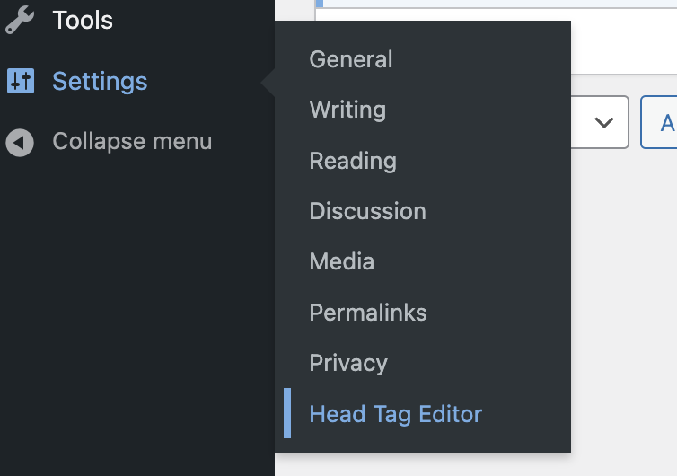
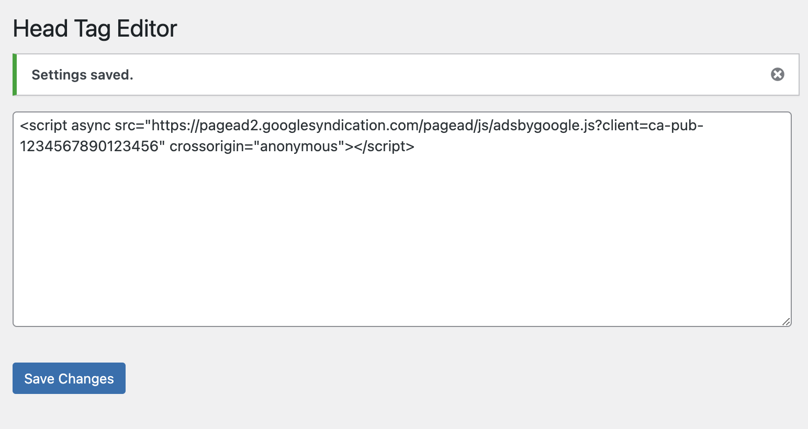

# The `<head>` tag Editor

This is head tag editor.

The installation process is very similar to [this repository][ads.txt_repo]

Download this repo as .zip and upload on Plugin Managiment Console; We can use download .zip as it is.

Go to Setting > Header Editor

Add any necessary code.

[ads.txt_repo]: https://github.com/kwtki/wordpress-ads.txt-editor
